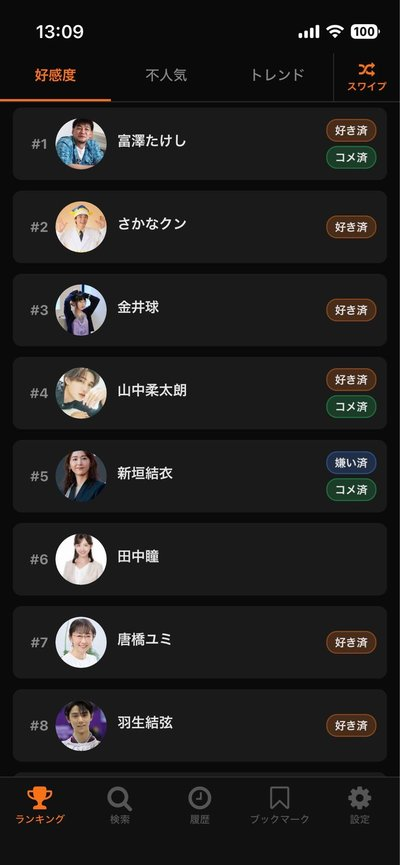
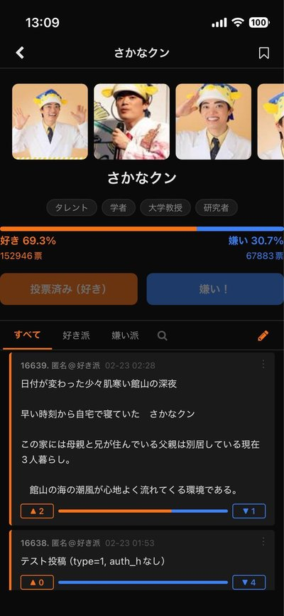
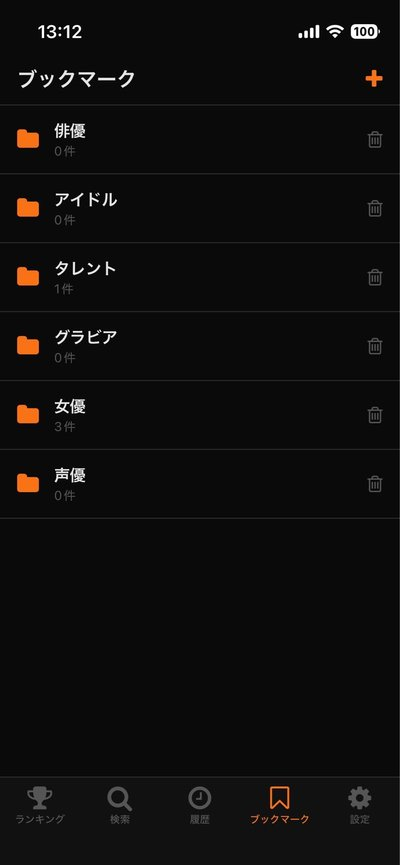
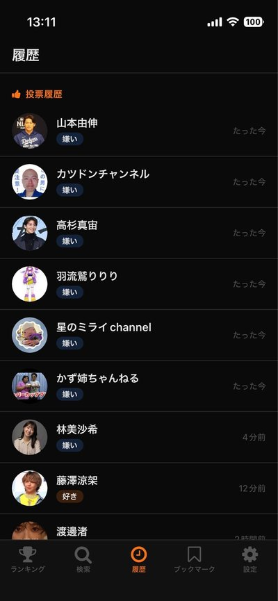

# 好き嫌い.comの専ブラを作ってApp Store と Google Playに公開した

## はじめに

**好き嫌い.com**（suki-kira.com）という Web サイトをご存知でしょうか。芸能人・有名人に対して「好き」「嫌い」を投票し、コメントで語り合う日本最大級の好感度投票サイトです。

このサイトには**公開 API が一切ありません**。ドキュメントもなければ、開発者向けのエンドポイントもない。あるのは HTML だけ。

そんなサイトの**ネイティブ専用ブラウザアプリ[「スキキラ」](https://sukikira.pages.dev)**を Expo（React Native）で開発し、[App Store](https://apps.apple.com/jp/app/id6759544300) と [Google Play](https://play.google.com/store/apps/details?id=net.votepurchase.sukikira) の両方に公開しました。

この記事では、API が存在しないサイトをどうやってアプリ化したのか、その調査プロセスと技術的な工夫について書きます。



## アプリの概要

**スキキラ**は好き嫌い.com の非公式ブラウザアプリです。Web サイトにはない独自機能を多数搭載しています。

| 機能 | 説明 |
|------|------|
| ランキング閲覧 | 好感度・不人気・トレンドの3タブ、無限スクロール |
| スワイプ投票 | Tinder風のカードUIで好き/嫌いを快速投票 |
| コメント閲覧・投稿 | 好き派/嫌い派フィルタ、スレ内検索、good/bad投票 |
| ブックマーク | フォルダ形式で人物をカテゴリ管理 |
| 履歴 | 投票・閲覧・コメント投稿の3種類を時系列表示 |
| NGワード | 不要なコメントをキーワードで非表示 |
| 再投票カウントダウン | 24時間の再投票制限をタイマー表示+ローカル通知 |




## 技術スタック

```
Expo (React Native) — モバイルアプリ本体
Vite — ランディングページ (apps/web/)
Cloudflare Pages — Web ホスティング
Python — サイト構造の調査スクリプト群
```

**バックエンドサーバーは一切使っていません。** アプリから好き嫌い.com に直接リクエストを送り、返ってきた HTML をパースして表示しています。

## APIがないサイトをどう攻略したか

### Step 1: Python スクリプトで HTML の構造を解剖する

好き嫌い.com の HTML 構造を理解するため、**36本の Python 調査スクリプト**を書きました。

```
scripts/
├── analyze_ranking.py          # ランキングページの HTML 構造
├── analyze_vote_form.py        # 投票フォームの hidden トークン
├── analyze_vote_cookie.py      # Cookie と IP トラッキングの仕様
├── analyze_comment_struct.py   # コメントの DOM 構造
├── analyze_comment_goodbad.py  # コメント good/bad API の仕様
├── analyze_result_tokens.py    # 結果ページのトークンの用途
├── analyze_xdate.py            # xdate パラメータの有効期限
├── analyze_parentheses.py      # 括弧付き人物名の URL エンコード
├── ... 他 28 本
└── out/                        # 各スクリプトの実行結果を保存
```

各スクリプトは「1つの疑問に1つのスクリプト」で設計しています。たとえば `analyze_vote_cookie.py` では以下の4ステップで Cookie の挙動を調査しました：

```python
# STEP 1: 人物Aに投票 → Set-Cookie ヘッダーを取得
# STEP 2: Cookie保持のまま人物B（未投票）の結果ページへアクセス
#          → Cookie がグローバルか人物ごとかを判定
# STEP 3: Cookie なしで人物Aの結果ページへアクセス
#          → Cookie が必須かどうかを確認
# STEP 4: Cookie なしで人物Aの投票ページへアクセス
#          → IP トラッキングの有無を確認
```

**判明した仕様:**
- Cookie は**人物ごと**に発行される（Aに投票してもBの結果は見えない）
- IP トラッキングが併用されている（Cookie なしでも投票済みと判定される）
- 再投票制限は**24時間**（Cookie の expires から確認）

このように、1つ1つの挙動を実験的に確認しながらサイトの仕様を解明していきました。

### Step 2: HTML パースのコア実装

調査結果をもとに、`sukikira.js` という1ファイルにすべてのリクエスト処理を集約しました。

```javascript
// sukikira.js — 好き嫌い.com への全リクエスト処理を集約
// 仕様変更時の修正箇所をこのファイルのみに限定する

const BASE_URL = 'https://suki-kira.com'

const HEADERS = {
  'User-Agent': 'Mozilla/5.0 (iPhone; CPU iPhone OS 17_0 like Mac OS X) ...',
  Accept: 'text/html,application/xhtml+xml,application/xml;q=0.9,*/*;q=0.8',
  'Accept-Language': 'ja-JP,ja;q=0.9',
}
```

ランキング取得の例です。ページ内の HTML 構造が1〜3位と4位以降で異なるため、2つの正規表現でパースしています：

```javascript
export const getRanking = async (type = 'like', page = 1) => {
  const html = await get(`/ranking/${type}/${page === 1 ? '' : page}`)
  const items = []

  // 1〜3位: <div class="ranking-card"> 形式
  const cardRegex = /<div[^>]*class="[^"]*ranking-card[^"]*"([\s\S]*?)(?=<div[^>]*class="[^"]*ranking-card|<section)/g
  while ((cm = cardRegex.exec(html)) !== null) {
    const block = cm[1]
    const url = block.match(/href="(\/people\/vote\/[^"]+)"/)?.[1] ?? ''
    // 名前は href からデコードして取得（h2テキストは表示名のみで括弧付き正式名と異なる）
    const name = url ? decodeURIComponent(url.replace('/people/vote/', '')) : ...
    items.push({ rank: items.length + 1, name, url, imageUrl, ... })
  }

  // 4位以降: <section class="box-rank-review"> 形式
  // ...（同様のパターンで抽出）
}
```

### Step 3: 投票フローの再現

投票機能の実装が最も複雑でした。サイトは CSRF 対策として複数の hidden トークンを使っています。

```
1. GET /people/vote/{name}  → HTML から id, auth1, auth2, auth-r を抽出
2. POST /people/result/{name} → トークンと投票内容を送信
3. レスポンスの HTML から結果をパース
```

```javascript
export const vote = async (name, voteType) => {
  // 1. フォームトークン取得
  const pageHtml = await get(`/people/vote/${encodeName(name)}`)
  const { id, auth1, auth2, authR } = parseVoteTokens(pageHtml)

  // 2. 投票 POST
  const body = new URLSearchParams({
    vote: voteType === 'like' ? '1' : '0',
    ok: 'ng',    // ← これがないとサーバーが受け付けない（調査で判明）
    id, auth1, auth2, 'auth-r': authR,
  }).toString()

  const res = await fetch(`${BASE_URL}/people/result/${encodeName(name)}`, {
    method: 'POST',
    headers: { ...HEADERS, 'Content-Type': 'application/x-www-form-urlencoded', Origin: BASE_URL },
    body,
  })
  return parseResult(await res.text())
}
```

`ok: 'ng'` というパラメータ名が直感に反しますが、これもスクリプトで実験して判明したものです。

### Step 4: コメント good/bad の隠し API

コメントへの good/bad 投票だけは、HTML のフォーム送信ではなく **JavaScript から呼ばれる JSON API** でした。

```javascript
// ブラウザの DevTools ではなく、HTML 内の JavaScript を解析して発見
export const voteComment = async (pidHash, commentId, voteType, token, xdate) => {
  const url = `https://api.suki-kira.com/comment/vote?xdate=${encodeURIComponent(xdate)}&evl=${voteType}`
  const body = new URLSearchParams({ pid: pidHash, token }).toString()
  // レスポンス: "0" = 成功, "5" = 重複（IP で拒否）
}
```

このエンドポイントは `api.suki-kira.com` という別サブドメインで、HTML ページ内の JavaScript コードを読解して見つけました。`xdate` は1分以内のものでないとサーバーに拒否されるという厳しいタイムスタンプ検証もあります（これも `analyze_xdate.py` で確認）。

## 開発中にハマったこと

### 1. h2 テキストと href の名前が違う問題

ランキングページで「田中瞳」を開くと「この人物は存在しません」エラーになるバグがありました。

**原因:** h2 タグのテキストは `田中瞳`（表示名）だが、href は `/people/vote/田中瞳 (アナウンサー)`（正式名）。同姓同名の人物を区別するために括弧付きの修飾語がつくケースがある。

```python
# analyze_parentheses3.py で生 HTML の文字コードまで調査
# h2.title: 田中瞳          ← 括弧なし（表示名）
# href:     田中瞳 (アナウンサー)  ← 括弧あり（正式名、U+0028/U+0029）
```

**修正:** 名前の取得元を h2 テキストから href のデコード結果に変更。

### 2. 投票結果ページのトークンは再投票用ではない

投票後に表示される結果ページにも `auth1`, `auth2` のトークンがあります。「これを使えば再投票できるのでは？」と思いましたが、調査の結果これらは**コメント投稿フォーム**用のトークンでした。

サーバーは IP アドレスで投票を追跡しており、24時間以内の再投票は完全にブロックします。

### 3. コメント投稿の `type` フィールド

コメント投稿で `type` を空文字列にするとサーバーは HTTP 200 を返すのに**コメントが保存されない**というサイレント失敗が起きます。`'1'`（好き派）または `'0'`（嫌い派）を明示的に指定する必要があります。これもスクリプトで投稿テストを繰り返して判明しました。

## アーキテクチャの設計思想

### すべてを1ファイルに集約

サイトの仕様変更は避けられません。そのとき修正箇所を最小限にするため、好き嫌い.com とのやりとりは `sukikira.js` の1ファイルに完全集約しています。

```
sukikira.js  ← ここだけ直せばいい
├── getRanking()    — ランキング取得
├── search()        — 検索
├── getComments()   — コメント取得
├── getMoreComments() — ページネーション
├── vote()          — 投票
├── voteComment()   — コメント good/bad
└── postComment()   — コメント投稿
```

UI 側のコードは `sukikira.js` が返す正規化されたデータだけを見るので、HTML の構造変更に UI が巻き込まれることはありません。

### バックエンドを持たない

バックエンドサーバーを挟む選択肢もありましたが、以下の理由で**アプリから直接リクエスト**する構成にしました：

- **運用コストゼロ**: サーバー代がかからない
- **レイテンシ削減**: 中間サーバーを経由しない分レスポンスが速い
- **プライバシー**: ユーザーのデータが自分のサーバーを通らない

代わりに IP トラッキングへの対応など、サーバーを持たないことによる制約もありますが、個人開発としてはメリットの方が大きいと判断しました。

### ローカルファーストの状態管理

投票履歴・ブックマーク・NGワード・コメント投票状態など、すべてのユーザーデータは `AsyncStorage` に保存しています。

```
@sukikira:voted        — 投票済み人物 { [name]: { type, votedAt } }
@sukikira:commentVoted — コメント good/bad { [commentId]: 'like'|'dislike' }
@sukikira:bookmarks    — ブックマークフォルダ
@sukikira:ngWords      — NGワードリスト
@sukikira:notifyVote   — 通知オンの人物マップ
@sukikira:notifyIds    — スケジュール済み通知ID
```

外部サービスへの依存がないため、アプリの寿命はサイトが生きている限り続きます。




## App Store / Google Play 審査

### 「API なしスクレイピングアプリ」は審査に通るのか？

結論から言うと、**通ります**。5ch 専用ブラウザ（ChMate, Jane Style 等）が長年ストアに掲載されている前例があります。

審査で重要だったポイント：

1. **Web サイトにはない独自機能があること**（Guideline 4.2）
   - スワイプ投票、ブックマーク、履歴、NGワード、スレ内検索 — いずれも Web にはない機能
2. **ユーザー生成コンテンツの管理手段**（Guideline 1.2）
   - コメント非表示、通報機能（サイト本体の通報ページへ遷移）、NGワード
3. **非公式であることの明示**
   - アプリ名・説明文・免責事項で非公式であることを明記

最初のリジェクトは EULA の配置とサポート URL の2点のみで、機能やスクレイピング自体は問題になりませんでした。

## 「Python スクリプト駆動開発」のすすめ

この開発で最も価値があったのは、**実装前に Python スクリプトでサイトの挙動を徹底的に調査した**ことです。

通常の API 開発では、ドキュメントを読んで理解 → 実装という流れになります。しかし API がないサイトでは：

```
仮説を立てる → Python スクリプトで実験 → 結果をファイルに保存 → 仕様を確定 → 実装
```

というサイクルを回します。36本のスクリプトとその出力ファイルは、事実上の **「自分で作った API ドキュメント」** になります。

```python
# 例: analyze_vote_cookie.py の出力（抜粋）

# ★ 判定: Cookie は人物ごと（B は未投票のため結果が見えない）
# ★ 判定: Cookie なしでも結果ページが見える（IP トラッキングで通過）
# ★ 判定: IP トラッキングあり（Cookie なしでも result ページへ誘導された）
```

この方法の利点：

- **再現性**: スクリプトを再実行すれば仕様変更を検出できる
- **ドキュメント**: スクリプト自体がサイトの仕様書になる
- **デバッグ**: バグが出たときに該当する調査スクリプトを再実行して原因切り分けできる

## まとめ

- API が公開されていないサイトでも、HTML 解析でネイティブアプリを作れる
- Python スクリプトでサイトの挙動を1つずつ実験的に確認するアプローチが有効
- リクエスト処理を1ファイルに集約することで、仕様変更への耐性を確保
- バックエンドを持たない構成でも App Store / Google Play の審査は通る
- 5ch 専ブラの前例があるため、スクレイピングアプリ自体はストアポリシー違反ではない

### リンク

- [GitHub](https://github.com/kiyohken2000/sukikira)
- [App Store](https://apps.apple.com/jp/app/id6759544300)
- [Google Play](https://play.google.com/store/apps/details?id=net.votepurchase.sukikira)
- [ランディングページ](https://sukikira.pages.dev)
